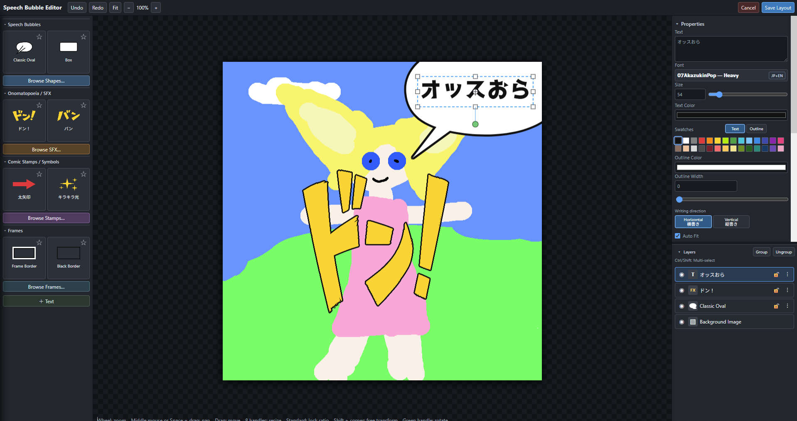
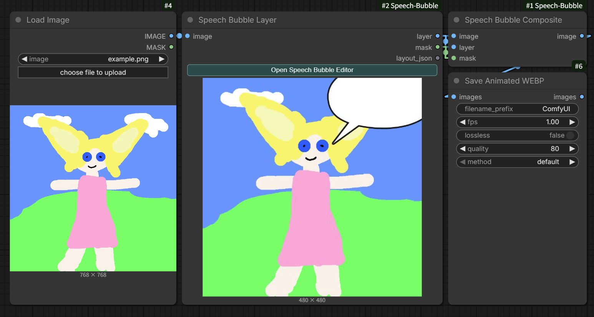
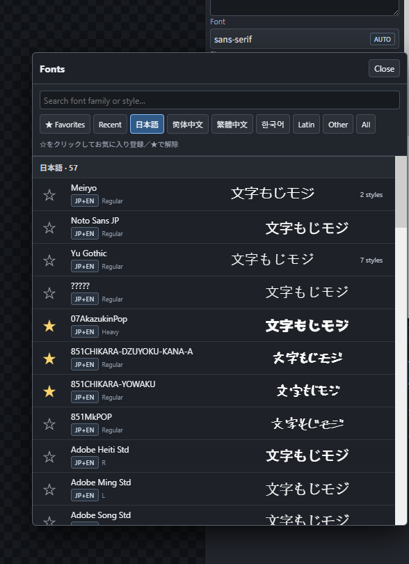

# ComfyUI Speech Bubble

ComfyUI上で、画像へ**吹き出し・テキスト・オノマトペ・コミックスタンプ・装飾フレーム**を重ねるためのカスタムノードです。専用エディターで配置を作り、レイアウトを保存してからワークフローを実行します。

出力は合成用の `layer` と `mask` です。必要に応じて `Speech Bubble Composite` ノードへ接続し、元画像へ合成できます。

<p align="center">
  <a href="docs/images/editor-overview.png"></a>
  <a href="docs/images/comfyui-workflow.png"></a>
  <a href="docs/images/font-browser.png"></a>
</p>

画像をクリックすると原寸で表示されます。

## インストール

ComfyUIを終了してから、`custom_nodes` フォルダーで実行します。

```powershell
git clone https://github.com/ukr8b3g-cmyk/Speech-Bubble-Layer.git ComfyUI-Speech-Bubble
```

すでに導入済みの場合は、対象フォルダーで更新します。

```powershell
git pull
```

その後、ComfyUIを起動または再起動し、ブラウザーをハードリロードしてください。

## 主な機能

このノードは漫画ページ全体を生成するものではなく、**一枚絵に会話・文字・記号・簡単な装飾枠を重ねるためのエディター**です。

- **吹き出しとテキスト**: 吹き出しの尻尾、文字内容、フォント、色、アウトライン、サイズを設定できます。最初に追加する吹き出しはテキストの下へ入ります。
- **文字組み**: Tracking（文字間隔）、Horizontal / Vertical Scale、太字、斜体、下線、取り消し線、横書き / 縦書き、Auto Fitに対応します。
- **素材**: Shape、SFX、コミックスタンプ、簡単なフレームを追加できます。現在は吹き出し9種、基本Shape 7種、SFX 180種、スタンプ29種、フレーム2種を収録しています。
- **色・サイズと効果**: テキストは文字色 / アウトライン色、Shape・SFX・スタンプは塗り / アウトライン色、フレームはボーダー / 内側アウトライン色を個別に変更できます。Outline Widthを`0`にすると枠線なしです。テキストはフォントサイズ、Shape・SFX・スタンプは比率を保つSizeまたはWidth / Heightで調整できます。スウォッチまたは任意色を使え、文字・Shape・SFX・スタンプにはDrop Shadow、フレームには内側シャドウとOuter Glowを設定できます。
- **レイヤー**: 表示 / 非表示、選択、グループ化、順序変更に対応します。フレームは通常クリックを下のレイヤーへ通します。
- **素材閲覧**: おすすめ・関連順、使用回数順、名前順で並び替えできます。カードの星を押したお気に入りは、左のクイック表示へ優先表示されます。

基本操作はマウスで行えますが、Propertiesの数値入力から位置・サイズ・色・不透明度などを正確に指定することもできます。

## 最初の使い方

1. `Load Image` の画像を `Speech Bubble Layer` の `image` へ接続します。
2. ノードの **Open Speech Bubble Editor** を押します。
3. 左側の一覧から吹き出し、SFX、スタンプ、フレームを追加します。
4. キャンバス上で位置・サイズ・回転を調整します。
5. 右側のPropertiesで文字、色、枠線、影などを設定します。
6. **Save Layout** を押してエディターの内容をノードへ保存します。
7. `layer` と `mask` を `Speech Bubble Composite` に接続して実行します。

`Speech Bubble Layer` 単体でもプレビューを表示します。最終的な合成結果を後段へ渡す場合は `Speech Bubble Composite` を使います。

## エディターの構成

### 左側: 素材一覧

- **Speech Bubbles / Shapes**: 吹き出し、基本図形、カラーShape
- **Onomatopoeia / SFX**: 漫画用の効果音・オノマトペ
- **Comic Stamps / Symbols**: 矢印、記号、感情表現、装飾
- **Frames**: ボーダーや前面装飾フレーム

素材カードの星はお気に入りです。クイック表示には、お気に入りを最大2件表示します。お気に入りがないときだけ定番素材を表示します。

### 中央: キャンバス

- クリックでレイヤーを選択し、ドラッグで移動します。
- 周囲のハンドルでサイズ変更、緑のハンドルで回転します。
- **Shift** を押しながら角ハンドルを操作すると、比率を固定して変形できます。
- マウスホイールで拡大・縮小し、ホイールクリックまたはSpace + ドラッグでキャンバスを移動します。
- フレームは通常、クリックを下のレイヤーへ通します。レイヤー一覧からフレームを選択したときだけ、ハンドルで直接編集できます。

### 右側: Properties と Layers

- **Text**: 内容、フォント、サイズ、色、アウトライン、文字間隔、書字方向
- **SFX / Stamp / Shape**: 比率を保つSize、必要に応じたWidth / Height、塗り・枠線・不透明度
- **Frame**: ボーダー色、内側アウトライン、余白、スケール、不透明度
- **Layers**: 表示、選択、グループ化、並び順の確認

色はスウォッチから素早く統一できます。任意色が必要な場合は通常のカラーピッカーを使います。

## 吹き出しの操作

- 黄色いハンドルで、話者を示す尻尾（ポインター）の向きと長さを360度自由に調整できます。
- 尻尾を吹き出し内部へ入れると非表示になります。
- 思考バブルでは同じ操作で思考点を調整します。
- Outline StyleではSolid / Double / Dashed / Dottedを選べます。

形状を再利用したい場合は、吹き出しを選択して **Save as User Preset…** を使います。保存対象は形状とそのパラメーターだけで、セリフ・位置・色・キャンバスサイズは含まれません。

## テキスト操作

- 左側の **+ Text** またはキーボードの **T** でテキストレイヤーを追加します。
- `Character Spacing (Tracking)` は文字間だけを変更します。負の値で詰め、正の値で広げます。
- Horizontal / Vertical Scale は文字そのものを横・縦方向へ伸縮します。
- Bold / Italic / Underline / Strike、横書き / 縦書き、Auto Fitを設定できます。
- テキストレイヤーを1つ選択した状態で、**Ctrl + 左右ハンドルのドラッグ**は横方向、**Ctrl + 上下ハンドルのドラッグ**は縦方向の文字変形です。
- `Ctrl+C` / `Ctrl+V` で選択レイヤーをコピー・貼り付けできます。複数選択とグループ関係も維持します。

## レイヤー操作

- `Ctrl` または `Shift` を押しながらクリックすると複数選択できます。
- Group / Ungroupで複数レイヤーをまとめられます。
- グループ内のレイヤーは **Altクリック** で個別選択できます。
- 数値欄へマウスを重ねてホイールを回すと値を調整できます。**Shift + ホイール** は10倍刻みです。

## 素材パックの追加

拡張素材は、カテゴリごとに1パック1フォルダーで配置します。

```text
web/assets/
├─ shapes/<pack-id>/manifest.json
├─ sfx/<pack-id>/manifest.json
└─ frames/<pack-id>/manifest.json
```

各 `manifest.json` では、パック内の相対パスだけを参照してください。素材追加後はComfyUIを再起動します。同じアセットIDを使うと後に読み込まれた定義が優先されるため、配布・更新時はIDを安定させてください。

素材パックの詳細は [web/assets/README.md](web/assets/README.md) を参照してください。フレームは `nine-slice`、`full-overlay`、`edge-repeat`、`decorated-border` の描画方式に対応します。

## 現在の対応範囲と今後

- 現在の対象は、**一枚絵へレイヤーを重ねる編集**です。複数コマ漫画や、複数画像をまたぐページレイアウトは対象外です。
- ユーザー素材パックやユーザープリセットを、より簡単に追加・共有できる仕組みは今後の検討項目です。
- A1111、Forge-Neo、ReForge系への移植も将来候補として検討しています。実装時期・対応を保証するものではありません。

## 保存・プレビュー

- **Save Layout** はレイアウトをノードへ保存し、最新プレビューを送信します。
- 次回エディターを開くと、保存済みレイアウトを復元します。
- ノードは最後に実行したプレビューを `output/speech_bubble_preview` に保持します。
- 編集中のライブプレビューは、ワークフローをQueueするまでは現在のセッション用です。

## ノード仕様

| ノード | 入力 | 出力 | 用途 |
| --- | --- | --- | --- |
| `Speech Bubble Layer` | `image`, `layout_json`, `font_path`, `supersample` | `layer`, `mask` | レイアウトから透明レイヤーとマスクを描画 |
| `Speech Bubble Composite` | `image`, `layer`, `mask` | `image` | 元画像とレイヤーを合成 |

- カテゴリー: `image/speech_bubble`
- `supersample`: 1〜4。大きいほど描画が滑らかになりますが、処理は重くなります。
- テキスト、Shape、SFX、スタンプ、フレームはレイアウトJSONに保存されます。
- フレームは最前面に描画されますが、通常時はキャンバスのクリック操作を妨げません。

## 開発・確認

基本的な確認は次で行えます。

```powershell
node tests/editor_geometry_test.mjs
node tests/preview_lifecycle_test.mjs
python -m py_compile __init__.py nodes_speech_bubble.py nodes_frame_cleanup.py
```

## トラブルシューティング

- **追加した素材が表示されない**: フォルダーと `manifest.json` の配置、相対パス、アセットIDを確認してComfyUIを再起動します。
- **古い画面が残る**: ブラウザーをハードリロードします。
- **文字が異なる書体に見える**: 使用するフォントがOSにインストールされているか確認し、エディターを再度開きます。
- **表示が重い**: 使わないドロワーを閉じ、必要に応じて `supersample` を下げます。

## ライセンスと素材

素材パックを追加する場合は、各素材の配布元・ライセンス条件を確認してください。透明WebPまたはPNGを基本とし、元画像のフリンジや不要な背景を残さない素材を推奨します。
