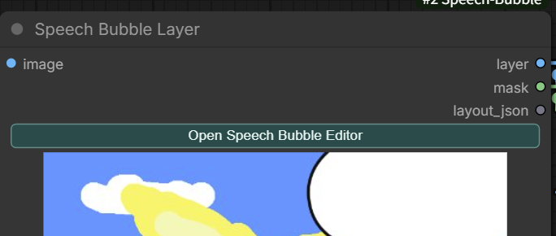
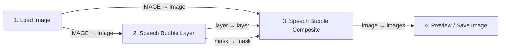

[English](#english)

<a id="japanese"></a>

# ComfyUI Speech Bubble

日本語 | [English](#english)

ComfyUI上で、画像へ**吹き出し・テキスト・オノマトペ・コミックスタンプ・装飾フレーム・集中線**を重ねるためのカスタムノードです。専用エディターで配置を作り、レイアウトを保存してからワークフローを実行します。

出力は合成用の `layer` と `mask` です。必要に応じて `Speech Bubble Composite` ノードへ接続し、元画像へ合成できます。

## まずここから

`Speech Bubble Layer` ノードの緑色の **Open Speech Bubble Editor** ボタンをクリックすると、専用エディターが開きます。吹き出しや文字の編集はここから始めます。

<p align="center">
  <a href="docs/images/open-speech-bubble-editor.png"></a>
</p>

<p align="center">
  <a href="docs/images/editor-overview.png"></a>
</p>

<p align="center">
  <a href="docs/images/comfyui-workflow.png"></a>
  <a href="docs/images/font-browser.png"></a>
</p>

画像をクリックすると原寸で表示されます。

## インストール

ComfyUIを終了してから、`custom_nodes` フォルダーで実行します。

```powershell
git clone https://github.com/ukr8b3g-cmyk/Speech-Bubble-Layer.git ComfyUI-Speech-Bubble
```

すでに導入済みの場合は、対象フォルダーで更新します。

```powershell
git pull
```

その後、ComfyUIを起動または再起動し、ブラウザーをハードリロードしてください。

## 主な機能

このノードは漫画ページ全体を生成するものではなく、**一枚絵に会話・文字・記号・簡単な装飾枠を重ねるためのエディター**です。

- **吹き出しとテキスト**: 吹き出しの尻尾、文字内容、フォント、色、アウトライン、サイズを設定できます。最初に追加する吹き出しはテキストの下へ入ります。
- **文字組み**: Tracking（文字間隔）、Horizontal / Vertical Scale、太字、斜体、下線、取り消し線、横書き / 縦書き、Auto Fitに対応します。
- **素材**: Shape、SFX、コミックスタンプ、簡単なフレームを追加できます。現在は吹き出し9種、基本Shape 7種、SFX 180種、スタンプ29種、フレーム2種を収録しています。
- **Emphasis Lines（集中線）**: Center / Wide / Tall / One Sideの4プリセットを収録しています。中心の空白、線数、太さ、長さ、ランダム性、注目位置を調整できます。
- **色・サイズと効果**: テキストは文字色 / アウトライン色、Shape・SFX・スタンプは塗り / アウトライン色、フレームはボーダー / 内側アウトライン色を個別に変更できます。Outline Widthを`0`にすると枠線なしです。テキストはフォントサイズ、Shape・SFX・スタンプは比率を保つSizeまたはWidth / Heightで調整できます。スウォッチまたは任意色を使え、文字・Shape・SFX・スタンプにはDrop Shadow、フレームには内側シャドウとOuter Glowを設定できます。
- **レイヤー**: 表示 / 非表示、選択、グループ化、順序変更に対応します。フレームは通常クリックを下のレイヤーへ通します。
- **素材閲覧**: おすすめ・関連順、使用回数順、名前順で並び替えできます。カードの星を押したお気に入りは、左のクイック表示へ優先表示されます。

基本操作はマウスで行えますが、Propertiesの数値入力から位置・サイズ・色・不透明度などを正確に指定することもできます。

## 最初の使い方

### ノードの接続



**サンプルワークフロー:** [Speech_Bubble_test_workflow.json](examples/Speech_Bubble_test_workflow.json)

ダウンロードしたJSONをComfyUIのキャンバスへドラッグ＆ドロップして読み込めます。`Load Image` の画像は自分の環境で選択し直してください。

1. `Load Image` の `IMAGE` を `Speech Bubble Layer` の `image` へ接続します。
2. 同じ `IMAGE` を `Speech Bubble Composite` の `image` にも分岐して接続します。
3. `Speech Bubble Layer` の `layer` と `mask` を、`Speech Bubble Composite` の同名入力へ接続します。
4. `Speech Bubble Composite` の `image` を、プレビューまたは `Save Image` へ接続します。

### 編集の順番

1. `Speech Bubble Layer` の **Open Speech Bubble Editor** を押します。
2. 左側の一覧から吹き出し、SFX、スタンプ、フレーム、Emphasis Linesを追加します。
3. キャンバス上で位置・サイズ・回転を調整します。
4. 右側のPropertiesで文字、色、枠線、影などを設定します。
5. **Save Layout** を押してエディターの内容をノードへ保存します。
6. ComfyUIでワークフローを実行し、`Speech Bubble Composite` の合成結果を確認します。

`Speech Bubble Layer` 単体でもプレビューを表示します。最終的な合成結果を後段へ渡す場合は `Speech Bubble Composite` を使います。

## エディターの構成

### 左側: 素材一覧

- **Speech Bubbles / Shapes**: 吹き出し、基本図形、カラーShape
- **Onomatopoeia / SFX**: 漫画用の効果音・オノマトペ
- **Comic Stamps / Symbols**: 矢印、記号、感情表現、装飾
- **Frames**: ボーダーや前面装飾フレーム
- **Emphasis Lines**: 画像全体へ重ねる集中線。お気に入りがない場合はCenter / Wideを表示

素材カードの星はお気に入りです。クイック表示には、お気に入りを最大2件表示します。お気に入りがないときだけ定番素材を表示します。

### 中央: キャンバス

- クリックでレイヤーを選択し、ドラッグで移動します。
- 周囲のハンドルでサイズ変更、緑のハンドルで回転します。
- **Shift** を押しながら角ハンドルを操作すると、比率を固定して変形できます。
- マウスホイールで拡大・縮小し、ホイールクリックまたはSpace + ドラッグでキャンバスを移動します。
- フレームは通常、クリックを下のレイヤーへ通します。レイヤー一覧からフレームを選択したときだけ、ハンドルで直接編集できます。

### 右側: Properties と Layers

- **Text**: 内容、フォント、サイズ、色、アウトライン、文字間隔、書字方向
- **SFX / Stamp / Shape**: 比率を保つSize、必要に応じたWidth / Height、塗り・枠線・不透明度
- **Frame**: ボーダー色、内側アウトライン、余白、スケール、不透明度
- **Emphasis Lines**: プリセット、線色、不透明度、線数、Center Gap、線幅・長さ、ランダム値、中心位置
- **Layers**: 表示、選択、グループ化、並び順の確認

色はスウォッチから素早く統一できます。任意色が必要な場合は通常のカラーピッカーを使います。

### 上部ツールバーと操作パッド

| 操作 | 内容 |
| --- | --- |
| Undo / Redo | 直前の編集を取り消す／やり直す |
| Fit / − / + | 画像全体を表示領域へ合わせる／ズーム倍率を変更する |
| Cancel | 保存せずにエディターを閉じる |
| Save Layout | レイアウトJSONと最新プレビューをノードへ保存する |
| 8方向シャドウパッド | Drop Shadow内の矢印で影の方向を選ぶ。中央の`•`でオフセットを0に戻す |
| Transform数値欄 | X / Y / W / H / Rotationを直接指定する。ホイールで増減、Shift + ホイールで10倍刻み |

画面下部のヒントどおり、通常の角ハンドルは比率を保ち、**Shift + 角ハンドル**で自由変形します。緑色は回転、吹き出しの黄色は尻尾、集中線の黄色は注目中心の操作ハンドルです。

### 主な設定

| 対象 | 設定 |
| --- | --- |
| Text | Text、Font、Size、Text / Outline Color、Outline Width、Writing direction、Auto Fit、Bold / Italic / Underline / Strike、Tracking、Horizontal / Vertical Scale |
| Speech Bubble | Preset、Tail、Fill / Stroke、Stroke Width、Opacity、Outline Style、形状調整、Edit Path、User Preset保存 |
| SFX / Stamp / Shape | Size、Width / Height、Opacity、Fill / Outline Color、Outline Width |
| Frame | Fit、Top、Border / Inner Outline、各辺の幅、Frame Scale、Inset、Overlay Fit、Drop Shadow、Outer Glow |
| Emphasis Lines | Preset、Line Color、Opacity、Line Count、Center Gap、Line Width / Length / Taper、Random、Seed、Center X / Y |
| Layers | 表示、ロック、複数選択、Group / Ungroup、コピー、複製、削除、順序変更 |

## 吹き出しの操作

- 黄色いハンドルで、話者を示す尻尾（ポインター）の向きと長さを360度自由に調整できます。
- 尻尾を吹き出し内部へ入れると非表示になります。
- 思考バブルでは同じ操作で思考点を調整します。
- Outline StyleではSolid / Double / Dashed / Dottedを選べます。

形状を再利用したい場合は、吹き出しを選択して **Save as User Preset…** を使います。保存対象は形状とそのパラメーターだけで、セリフ・位置・色・キャンバスサイズは含まれません。

## テキスト操作

- 左側の **+ Text** またはキーボードの **T** でテキストレイヤーを追加します。
- `Character Spacing (Tracking)` は文字間だけを変更します。負の値で詰め、正の値で広げます。
- Horizontal / Vertical Scale は文字そのものを横・縦方向へ伸縮します。
- Bold / Italic / Underline / Strike、横書き / 縦書き、Auto Fitを設定できます。
- テキストレイヤーを1つ選択した状態で、**Ctrl + 左右ハンドルのドラッグ**は横方向、**Ctrl + 上下ハンドルのドラッグ**は縦方向の文字変形です。
- `Ctrl+C` / `Ctrl+V` で選択レイヤーをコピー・貼り付けできます。複数選択とグループ関係も維持します。

## Emphasis Lines（集中線レイヤー）

Emphasis Linesは独立したComfyUIノードではなく、`Speech Bubble Layer` のエディター内へ追加する集中線レイヤーです。人物や注目箇所の周囲へ放射線を配置し、漫画的な強調・緊張・速度感を加えます。

### 基本操作

1. 左側の **Emphasis Lines** からプリセットをクリックします。
2. Layersで追加された `Emphasis — ...` レイヤーを選択します。
3. **Center Gap** で人物周辺の空白を調整します。
4. 黄色い中心ハンドルをドラッグして、集中線の注目位置を合わせます。
5. 必要に応じて線数、太さ、色、ランダム性を調整し、**Save Layout** で保存します。

お気に入りがない場合、左側にはCenterとWideを表示します。カードの星を押すと、任意のプリセットをクイック表示へ登録できます。

### プリセット

| プリセット | 用途 |
| --- | --- |
| Center | 中央へ均等に注目を集める標準的な集中線 |
| Wide | 横長の被写体や顔・上半身を広く囲む集中線 |
| Tall | 縦長の人物や全身画像向けの集中線 |
| One Side | 画面外または片側から注目を集める演出 |

### 主な設定

| 設定 | 内容 |
| --- | --- |
| Line Color / Swatches | 線色をカラーピッカーまたは共通スウォッチから選択 |
| Opacity | 集中線全体の不透明度 |
| Line Count | 放射線の本数 |
| Center Gap | 中央の空白をX / Y比率を保ったまま一括調整 |
| Center Gap X / Y | 中央の空白を横・縦方向へ個別に微調整 |
| Base Line Width | 線の基本幅 |
| Line Length / Taper | 線の長さと先細り具合 |
| Random | 長さ、開始位置、太さ、間隔のばらつき |
| Seed / New Seed | 線パターンの再現または新規生成 |
| Precise Center Position | 注目位置をX / Y数値で正確に指定 |

集中線は通常のキャンバスクリックを下のレイヤーへ通すため、選択・削除・並び順の変更はLayersから行います。同じSeedと設定は同じ線形状を再現します。**Save Layout** では生成済みの線形状もレイアウトJSONへ保存されるため、エディター表示、ノードの`layer`出力、`mask`出力が一致します。

## レイヤー操作

- `Ctrl` または `Shift` を押しながらクリックすると複数選択できます。
- Group / Ungroupで複数レイヤーをまとめられます。
- グループ内のレイヤーは **Altクリック** で個別選択できます。
- 数値欄へマウスを重ねてホイールを回すと値を調整できます。**Shift + ホイール** は10倍刻みです。

## 素材パックの追加

拡張素材は、カテゴリごとに1パック1フォルダーで配置します。

```text
web/assets/
├─ shapes/<pack-id>/manifest.json
├─ sfx/<pack-id>/manifest.json
└─ frames/<pack-id>/manifest.json
```

各 `manifest.json` では、パック内の相対パスだけを参照してください。素材追加後はComfyUIを再起動します。同じアセットIDを使うと後に読み込まれた定義が優先されるため、配布・更新時はIDを安定させてください。

素材パックの詳細は [web/assets/README.md](web/assets/README.md) を参照してください。フレームは `nine-slice`、`full-overlay`、`edge-repeat`、`decorated-border` の描画方式に対応します。

## 現在の対応範囲と今後

- 現在の対象は、**一枚絵へレイヤーを重ねる編集**です。複数コマ漫画や、複数画像をまたぐページレイアウトは対象外です。
- ユーザー素材パックやユーザープリセットを、より簡単に追加・共有できる仕組みは今後の検討項目です。
- A1111、Forge-Neo、ReForge系への移植も将来候補として検討しています。実装時期・対応を保証するものではありません。

## 保存・プレビュー

- **Save Layout** はレイアウトをノードへ保存し、最新プレビューを送信します。
- 次回エディターを開くと、保存済みレイアウトを復元します。
- ノードは最後に実行したプレビューを `output/speech_bubble_preview` に保持します。
- 編集中のライブプレビューは、ワークフローをQueueするまでは現在のセッション用です。

## ノード仕様

| ノード | 入力 | 出力 | 用途 |
| --- | --- | --- | --- |
| `Speech Bubble Layer` | `image`, `layout_json`, `font_path`, `supersample` | `layer`, `mask` | レイアウトから透明レイヤーとマスクを描画 |
| `Speech Bubble Composite` | `image`, `layer`, `mask` | `image` | 元画像とレイヤーを合成 |

- カテゴリー: `image/speech_bubble`
- `supersample`: 1〜4。大きいほど描画が滑らかになりますが、処理は重くなります。
- テキスト、Shape、SFX、スタンプ、フレーム、Emphasis LinesはレイアウトJSONに保存されます。
- フレームは最前面に描画されますが、通常時はキャンバスのクリック操作を妨げません。

## 実ファイル・セットアップ関連リンク

| 種類 | リンク |
| --- | --- |
| GitHubリポジトリ | [Speech-Bubble-Layer](https://github.com/ukr8b3g-cmyk/Speech-Bubble-Layer) |
| mainのZIP | [Source code ZIP](https://github.com/ukr8b3g-cmyk/Speech-Bubble-Layer/archive/refs/heads/main.zip) |
| サンプルワークフロー | [examples/Speech_Bubble_test_workflow.json](examples/Speech_Bubble_test_workflow.json) |
| ComfyUI登録・セットアップ入口 | [__init__.py](__init__.py) |
| ComfyUIフロントエンド拡張 | [web/js/speech_bubble.js](web/js/speech_bubble.js) |
| エディター本体 | [web/speech-bubble-editor.html](web/speech-bubble-editor.html) |
| Python描画・ノード本体 | [nodes_speech_bubble.py](nodes_speech_bubble.py) |
| 素材パック仕様 | [web/assets/README.md](web/assets/README.md) |
| フレーム素材仕様 | [web/assets/frames/README.md](web/assets/frames/README.md) |
| 配布ファイル一覧 | [RELEASE_FILE_LIST.txt](RELEASE_FILE_LIST.txt) |
| 確認項目 | [VERIFICATION.md](VERIFICATION.md) |

手動セットアップでは、ZIPを展開したフォルダー名を `ComfyUI-Speech-Bubble` にし、`ComfyUI/custom_nodes/` 直下へ配置してください。最終的に `ComfyUI/custom_nodes/ComfyUI-Speech-Bubble/__init__.py` が存在する階層なら正しい配置です。

## 開発・確認

基本的な確認は次で行えます。

```powershell
node tests/editor_geometry_test.mjs
node tests/preview_lifecycle_test.mjs
python -m py_compile __init__.py nodes_speech_bubble.py nodes_frame_cleanup.py
```

## トラブルシューティング

- **追加した素材が表示されない**: フォルダーと `manifest.json` の配置、相対パス、アセットIDを確認してComfyUIを再起動します。
- **古い画面が残る**: ブラウザーをハードリロードします。
- **文字が異なる書体に見える**: 使用するフォントがOSにインストールされているか確認し、エディターを再度開きます。
- **表示が重い**: 使わないドロワーを閉じ、必要に応じて `supersample` を下げます。

## ライセンスと素材

素材パックを追加する場合は、各素材の配布元・ライセンス条件を確認してください。透明WebPまたはPNGを基本とし、元画像のフリンジや不要な背景を残さない素材を推奨します。

---

<a id="english"></a>

# ComfyUI Speech Bubble — English

[日本語](#japanese) | English

This custom node overlays **speech bubbles, text, onomatopoeia/SFX, comic stamps, decorative frames, and emphasis lines** on an image in ComfyUI. Build the composition in the dedicated editor, save the layout, and then run the workflow.

The node outputs a transparent `layer` and `mask`. Connect them to `Speech Bubble Composite` when you want the final image composited over the source.

## Start here

Click the green **Open Speech Bubble Editor** button on the `Speech Bubble Layer` node. All bubble, text, and decoration editing starts in this editor.

The screenshots at the beginning of this README show the launch button, editor, workflow, and font browser. Click an image to open it at full size.

## Installation

Stop ComfyUI, open its `custom_nodes` folder, and run:

```powershell
git clone https://github.com/ukr8b3g-cmyk/Speech-Bubble-Layer.git ComfyUI-Speech-Bubble
```

To update an existing installation, run this inside the installed folder:

```powershell
git pull
```

Start or restart ComfyUI, then hard-refresh the browser. For a manual ZIP installation, see [Files and setup links](#files-and-setup-links).

## Main features

- **Speech bubbles and text:** edit the tail, dialogue, font, colors, outline, and size. A newly inserted bubble is placed below the text layer.
- **Typography:** Tracking, Horizontal / Vertical Scale, bold, italic, underline, strike, horizontal / vertical writing, and Auto Fit.
- **Assets:** included bubbles, basic shapes, SFX, comic stamps, and frames.
- **Emphasis Lines:** Center, Wide, Tall, and One Side presets with adjustable gap, count, width, length, randomness, seed, and focus position.
- **Color and effects:** separate fill and outline controls, shared swatches, drop shadows, frame inner outlines, and outer glow.
- **Layers:** show/hide, lock, multi-select, group, copy, duplicate, delete, and reorder.
- **Asset browsing:** recommended/related, usage, and name sorting. Favorites appear first in the compact quick lists.

This editor is designed to decorate one image. It is not a multi-panel comic-page generator.

## Basic workflow

### Node connections


**Sample workflow:** [Speech_Bubble_test_workflow.json](examples/Speech_Bubble_test_workflow.json)

Drag the downloaded JSON onto the ComfyUI canvas and select your own source in `Load Image`.

1. Connect `Load Image: IMAGE` to `Speech Bubble Layer: image`.
2. Branch the same `IMAGE` to `Speech Bubble Composite: image`.
3. Connect `Speech Bubble Layer: layer` and `mask` to the matching Composite inputs.
4. Connect `Speech Bubble Composite: image` to Preview or `Save Image`.

### Editing sequence

1. Click **Open Speech Bubble Editor** on the `Speech Bubble Layer` node.
2. Add a bubble, text, SFX, stamp, frame, or Emphasis Lines from the left panel.
3. Move, resize, and rotate it on the canvas.
4. Edit text, color, outline, effects, and exact values in Properties.
5. Click **Save Layout** to store the editor state in the node.
6. Queue the ComfyUI workflow and inspect the `Speech Bubble Composite` result.

`Speech Bubble Layer` also shows its own preview. Use `Speech Bubble Composite` when the merged image must continue to downstream nodes.

## Editor panels

### Left panel: asset lists

- **Speech Bubbles:** bubbles, basic shapes, colored shapes, and user presets.
- **Onomatopoeia / SFX:** comic sound-effect artwork.
- **Comic Stamps / Symbols:** arrows, marks, emotions, and decorations.
- **Frames:** borders and foreground overlay frames.
- **Emphasis Lines:** full-canvas radial emphasis presets.
- **+ Text:** inserts an independent text layer.

Click a card to add it, or drag supported cards to place them directly. Use **Browse…** to search and filter the full catalog. The star marks a favorite; up to two favorites are shown in each quick list.

### Center: canvas

- Click to select and drag to move.
- Use the eight surrounding handles to resize and the green handle to rotate.
- Standard corner resizing preserves the aspect ratio; hold **Shift** for free transform.
- Use the mouse wheel to zoom. Pan with the middle mouse button or Space + drag.
- Frames and Emphasis Lines normally pass canvas clicks through to lower layers. Select them in Layers for direct editing.

### Right panel: Properties and Layers

- **Properties:** shows controls for the selected Text, Speech Bubble, SFX/Stamp/Shape, Frame, or Emphasis Lines layer.
- **Transform:** exact X, Y, W, H, and Rotation values.
- **Drop Shadow:** color, direction pad, X/Y offset, and blur.
- **Layers:** visibility, lock state, selection, grouping, order, copy, duplicate, and delete.

Properties and Layers can be collapsed. Drag the divider between them to change their vertical allocation.

## Toolbar and operation pads

| Control | Action |
| --- | --- |
| Undo / Redo | Revert or restore the latest editor action |
| Fit / − / + | Fit the image to the viewport or change zoom |
| Cancel | Close without saving the current editor changes |
| Save Layout | Save the layout JSON and latest preview back to the node |
| Eight-direction shadow pad | Choose the shadow direction; the center `•` resets the offset to zero |
| Transform numeric fields | Set X / Y / W / H / Rotation exactly; wheel adjusts a value and Shift + wheel uses 10× steps |

The yellow bubble handle controls its tail. The yellow Emphasis Lines handle controls the focus point.

## Settings reference

| Layer | Main settings |
| --- | --- |
| Text | Text, Font, Size, Text / Outline Color, Outline Width, Writing direction, Auto Fit, Bold / Italic / Underline / Strike, Tracking, Horizontal / Vertical Scale |
| Speech Bubble | Preset, Tail, Fill / Stroke, Stroke Width, Opacity, Outline Style, shape tuning, Edit Path, Save as User Preset |
| SFX / Stamp / Shape | Size, Width / Height, Opacity, Fill / Outline Color, Outline Width |
| Frame | Fit, Top, Border / Inner Outline, side widths, Frame Scale, Inset, Overlay Fit, Drop Shadow, Outer Glow |
| Emphasis Lines | Preset, Line Color, Opacity, Line Count, Center Gap, Line Width / Length / Taper, Random, Seed, Center X / Y |
| Layers | Show/hide, lock, multi-select, Group / Ungroup, copy, duplicate, delete, and order |

`Outline Width = 0` disables the outline. The Size control for SFX, stamps, and shapes changes width and height together while preserving the current aspect ratio.

## Speech bubble controls

- Drag the yellow handle through 360 degrees to point the tail at the speaker and change its length.
- Move the tail into the bubble body to hide it.
- The same interaction positions the dots on thought bubbles.
- Outline Style supports the styles exposed by the selected preset.
- Use **Save as User Preset…** to reuse a shape. It saves shape geometry and parameters, not dialogue, position, colors, or canvas size.
- Use **Edit Path**, **+ Point**, and **− Point** for direct Bézier-path editing where supported.

## Text controls

- Add text with **+ Text** or the **T** key.
- Tracking changes only character spacing: negative values tighten and positive values expand.
- Horizontal / Vertical Scale stretches the glyphs themselves.
- Bold, Italic, Underline, Strike, horizontal/vertical writing, and Auto Fit are available.
- With one text layer selected, **Ctrl + drag a left/right handle** stretches glyphs horizontally; **Ctrl + drag a top/bottom handle** stretches them vertically.
- `Ctrl+C` / `Ctrl+V` copies and pastes selected layers while preserving multi-selection and group relationships.

## Emphasis Lines

Emphasis Lines are editor layers inside `Speech Bubble Layer`, not a separate ComfyUI node.

1. Add a preset from **Emphasis Lines**.
2. Select the new `Emphasis — ...` entry in Layers.
3. Adjust **Center Gap** to clear space around the subject.
4. Drag the yellow center handle to the focus point.
5. Tune the line count, width, length, color, or randomness and click **Save Layout**.

| Preset | Typical use |
| --- | --- |
| Center | Balanced focus toward the canvas center |
| Wide | Faces, upper bodies, or other wide subjects |
| Tall | Full-body or other tall subjects |
| One Side | Focus entering from one side or outside the frame |

Center Gap scales X and Y together while preserving their ratio; Center Gap X/Y fine-tune them independently. The same Seed and settings reproduce the same rays. Generated rays are stored in the layout JSON so the editor, `layer`, and `mask` outputs stay aligned.

## Layer operations

- Ctrl-click or Shift-click for multi-selection.
- Group / Ungroup combines or separates layers.
- Alt-click selects one layer inside a group; Alt-drag moves it independently.
- Use the eye and lock buttons for visibility and edit protection.
- Open the layer options menu for Copy, Paste, Duplicate, or Delete.

## Adding asset packs

Place one pack per folder under its category:

```text
web/assets/
├─ shapes/<pack-id>/manifest.json
├─ sfx/<pack-id>/manifest.json
└─ frames/<pack-id>/manifest.json
```

Each `manifest.json` must use paths relative to its pack folder. Restart ComfyUI after adding assets. Keep asset IDs stable because a later definition with the same ID takes precedence.

See [web/assets/README.md](web/assets/README.md) for the general pack format. Frame packs support `nine-slice`, `full-overlay`, `edge-repeat`, and `decorated-border`; see [web/assets/frames/README.md](web/assets/frames/README.md).

## Save and preview behavior

- **Save Layout** writes the layout to the node and sends the latest preview.
- Reopening the editor restores the saved layout.
- The node keeps its last executed preview under `output/speech_bubble_preview`.
- Live previews during editing belong to the current session until the workflow is queued.
- Interactive canvas rendering is batched for responsiveness; full preview transmission is deferred until a committed edit.

## Node reference

| Node | Inputs | Outputs | Purpose |
| --- | --- | --- | --- |
| `Speech Bubble Layer` | `image`, `layout_json`, `font_path`, `supersample` | `layer`, `mask` | Render a transparent decoration layer and mask from the saved layout |
| `Speech Bubble Composite` | `image`, `layer`, `mask` | `image` | Composite the layer over the source image |

- Category: `image/speech_bubble`
- `supersample`: 1–4. Higher values improve render smoothness but require more processing.
- Text, shapes, SFX, stamps, frames, and Emphasis Lines are saved in the layout JSON.

## Files and setup links

| Item | Link |
| --- | --- |
| GitHub repository | [Speech-Bubble-Layer](https://github.com/ukr8b3g-cmyk/Speech-Bubble-Layer) |
| ZIP of `main` | [Source code ZIP](https://github.com/ukr8b3g-cmyk/Speech-Bubble-Layer/archive/refs/heads/main.zip) |
| Sample workflow | [examples/Speech_Bubble_test_workflow.json](examples/Speech_Bubble_test_workflow.json) |
| ComfyUI registration/setup entry | [__init__.py](__init__.py) |
| ComfyUI frontend extension | [web/js/speech_bubble.js](web/js/speech_bubble.js) |
| Editor implementation | [web/speech-bubble-editor.html](web/speech-bubble-editor.html) |
| Python renderer and nodes | [nodes_speech_bubble.py](nodes_speech_bubble.py) |
| Asset-pack specification | [web/assets/README.md](web/assets/README.md) |
| Frame-pack specification | [web/assets/frames/README.md](web/assets/frames/README.md) |
| Distribution file list | [RELEASE_FILE_LIST.txt](RELEASE_FILE_LIST.txt) |
| Verification notes | [VERIFICATION.md](VERIFICATION.md) |

For a manual ZIP setup, rename the extracted folder to `ComfyUI-Speech-Bubble` and place it directly under `ComfyUI/custom_nodes/`. The final path must contain `ComfyUI/custom_nodes/ComfyUI-Speech-Bubble/__init__.py`.

## Development and verification

Run the relevant checks from the repository root:

```powershell
node tests/editor_geometry_test.mjs
node tests/render_optimization_test.mjs
node tests/preview_lifecycle_test.mjs
python -m py_compile __init__.py nodes_speech_bubble.py nodes_frame_cleanup.py
```

## Troubleshooting

- **New assets do not appear:** check the folder, `manifest.json`, relative paths, and asset IDs, then restart ComfyUI.
- **The old editor remains:** hard-refresh the browser.
- **Text uses a different typeface:** confirm that the font is installed in the OS and reopen the editor.
- **The editor feels heavy:** close unused drawers and lower `supersample` if needed.

## License and assets

Before distributing additional packs, check each asset's source and license. Transparent WebP or PNG is recommended; remove background residue and edge fringing from source artwork.
